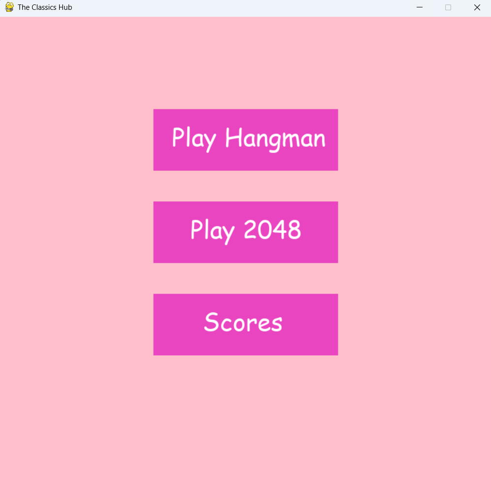
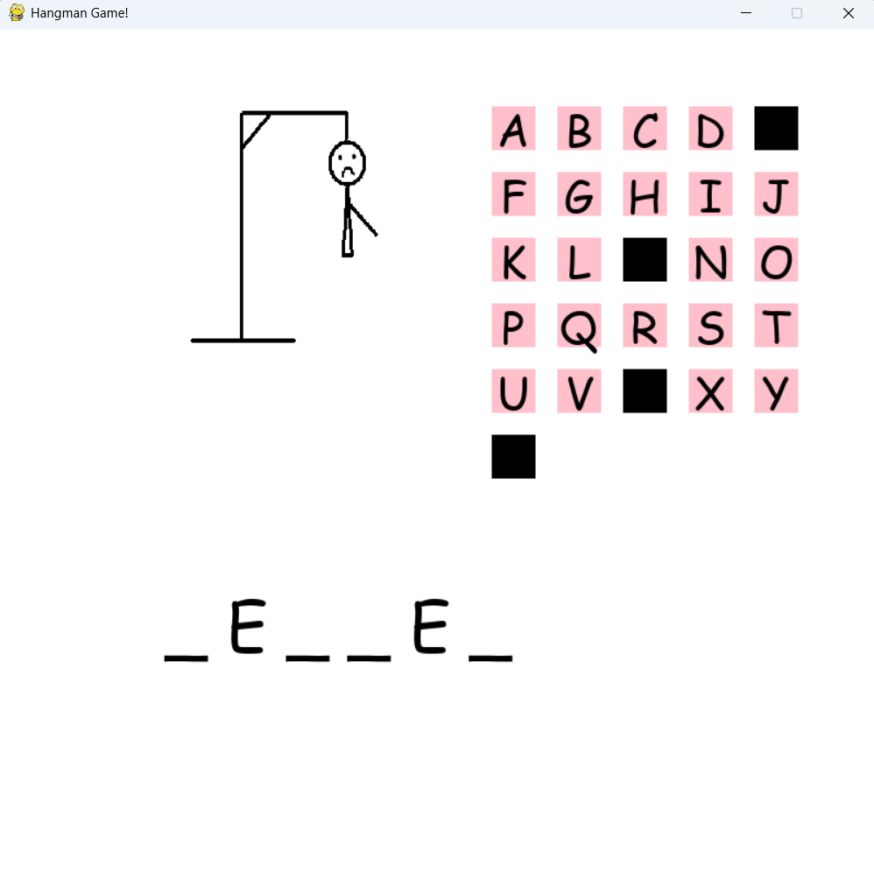
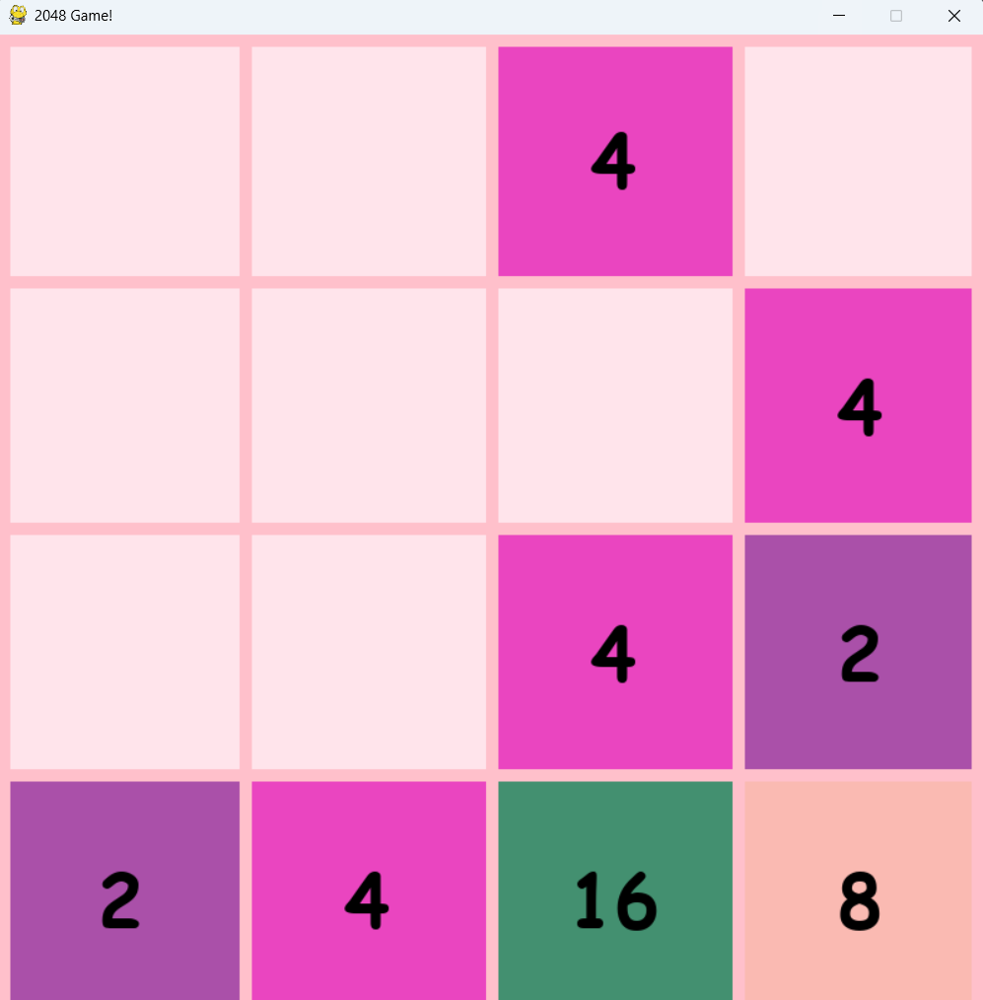
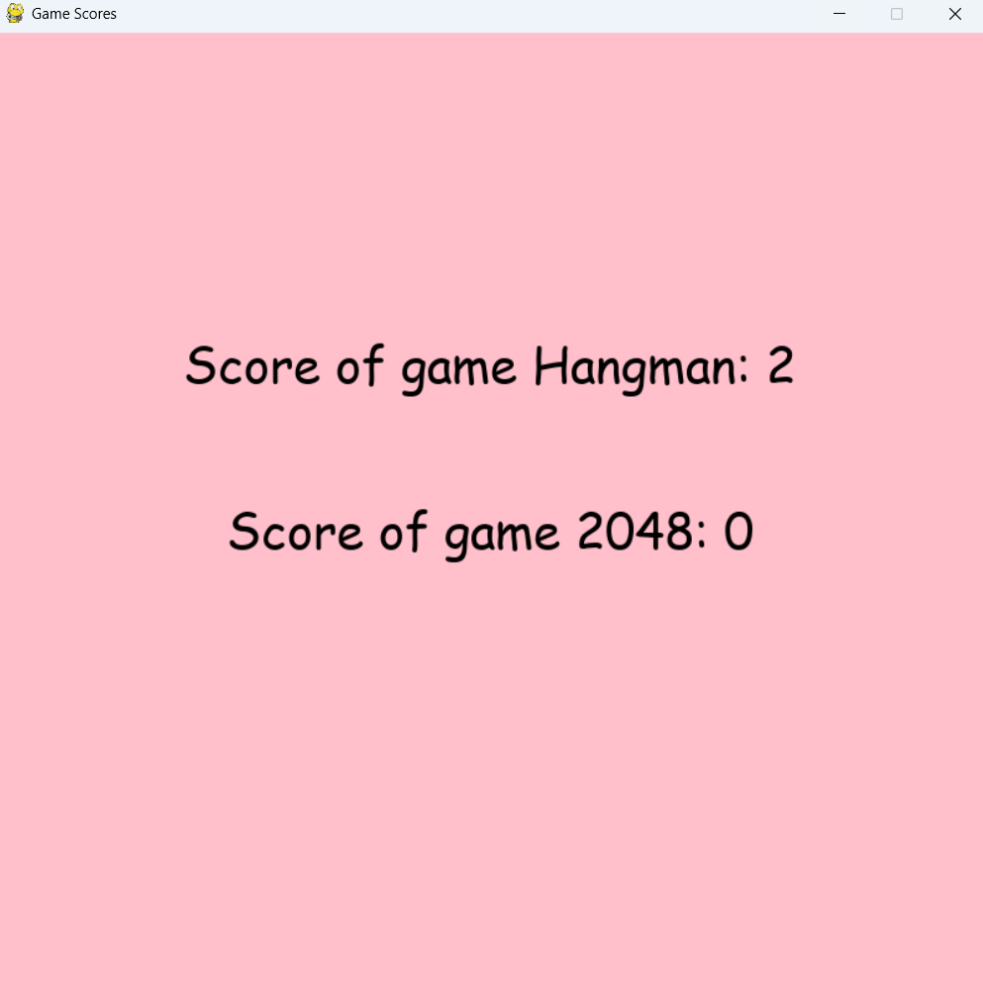

# Hangman & 2048 (Pygame)

A Python project that includes two classic games:
- Hangman
- 2048

## Features
- Menu system to choose between games
- Object-oriented design
- Pygame-based UI
- Score tracking system
- File handling for saving and loading scores

## Technologies
- Python
- Pygame

## How to run

1. Install dependencies:

```bash
pip install pygame
```

2. Navigate to the Platform folder:

```bash
cd Platform
```

3. Run the game:

```bash
python platform.py
```

## Screenshots

### Menu


### Hangman


### 2048


### Scores



## What I learned
- OOP design
- Game loops
- Event handling in Pygame
- File handling